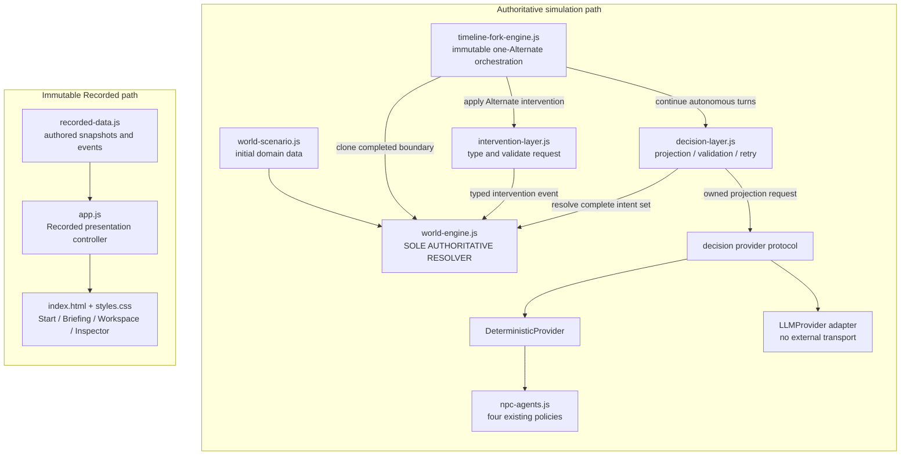
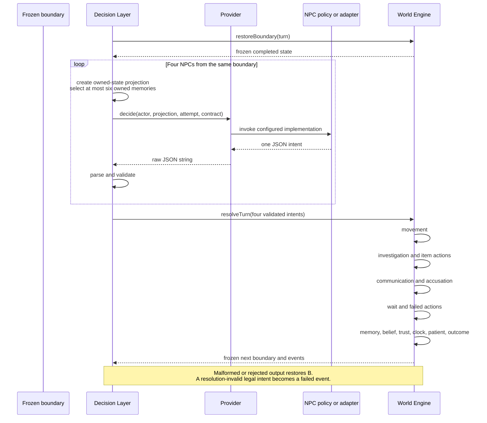
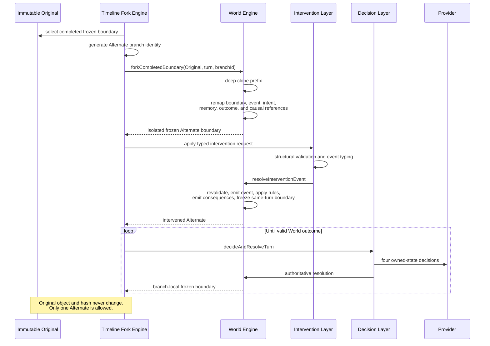

# Forked Fates System Diagram

**Snapshot:** `0635ad1`

## Runtime dependency and authority map

The Recorded path has no production dependency on the simulation path.

## Autonomous turn sequence

## Intervention and timeline fork sequence

## Authority legend

- Solid arrows indicate runtime calls or data dependencies.
- Only `world-engine.js` may convert intents or intervention events into authoritative state changes.
- Timeline, Intervention, Decision, Provider, and policy modules operate on immutable inputs or create requests; they do not directly mutate World state.
