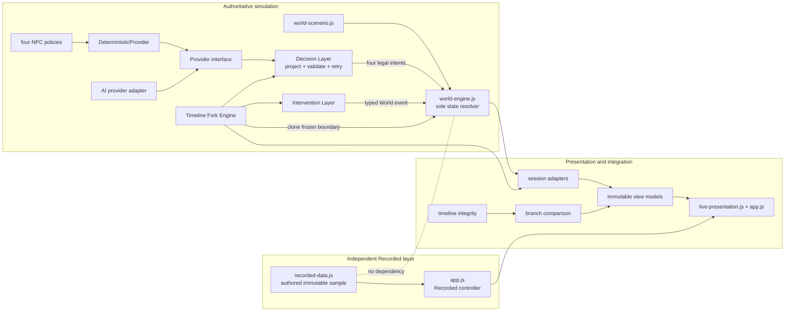
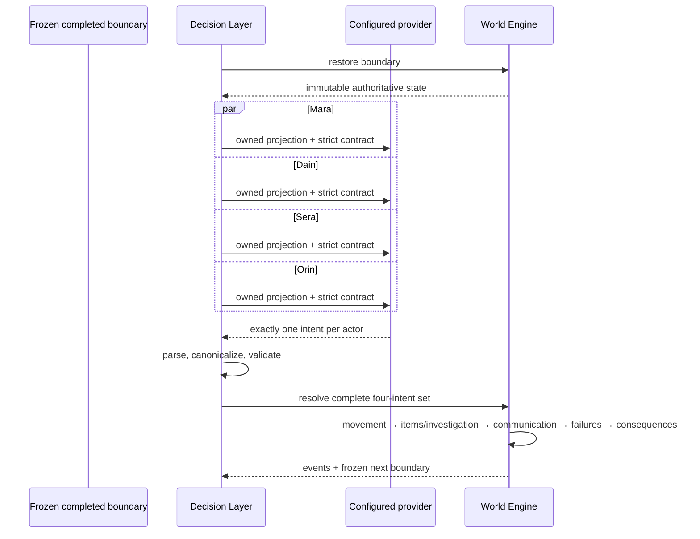
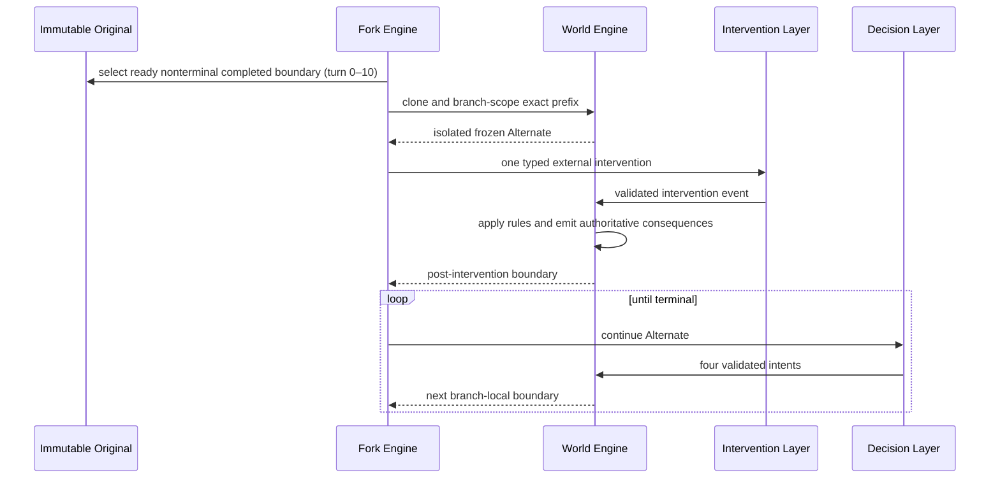

# Forked Fates System Architecture

## System summary

Forked Fates contains two deliberately independent story systems:

1. **Recorded Demo** renders immutable authored data from `src/data/recorded-data.js`. It does not import or execute the World Engine, decisions, policies, providers, interventions, or forks.
2. **Authoritative simulation** evolves an immutable World state. A Decision Layer obtains one validated intent from each of four autonomous NPCs, then the World Engine resolves the complete turn. Deterministic and AI Live providers share this authority boundary.

Presentation is a third layer. It derives browser views from Recorded data or frozen simulation sessions but never computes World consequences.

The product is framework-free JavaScript. Runtime modules use UMD wrappers for browser globals and CommonJS for Node tests. A dependency-free loopback Node server hosts static files and proxies configured AI-provider calls.

## Authority and dependency map

Only `src/engine/world-engine.js` may translate intents or interventions into authoritative changes.

## Source responsibilities

### Recorded layer — `src/data/recorded-data.js`

- Stores the complete authored twelve-turn demonstration.
- Owns stable Recorded identities, snapshots, memories, beliefs, events, and outcomes.
- Is immutable sample data and independently executable.
- Is never generated from, checked by, or replaced with World replay at runtime.

### Scenario data — `src/data/world-scenario.js`

- Defines the starting World for The Last Antidote.
- Contains exactly four NPCs, three locations, one antidote, facts, goals, and the twelve-turn deadline.
- Supplies domain data, not presentation structures.

### World layer — `src/engine/`

`world-engine.js` owns authoritative state, simultaneous resolution order, locations, inventory, memories, beliefs, trust, public record, patient state, clock, events, causal links, boundaries, and outcomes.

`intervention-layer.js` accepts only typed Information, Item Transfer, or Environmental requests. It performs structural checks and delegates consequences to the World Engine. It never mutates state directly.

`timeline-fork-engine.js` orchestrates one immutable Original and one isolated Alternate. It clones an eligible completed boundary, scopes branch identities, applies exactly one intervention, and continues through the unchanged Decision and World layers.

`timeline-integrity.js` validates branch-local references, exact copied-prefix source alignment, causal ordering, temporal memory availability, intervention placement, boundary order, outcome attribution, and object isolation. Comparison uses this validator before deriving results.

### AI and Decision layer — `src/ai/`

`decision-layer.js` builds one owned-state projection per character, selects at most six relevant owned memories, requests one provider intent, parses and validates it, and preserves frozen-boundary retry semantics.

`decision-providers.js` defines the provider protocol. `DeterministicProvider` delegates to the approved policies in `npc-agents.js`; the LLM adapter contract supports provider replacement without changing Decision or World logic.

`ai-owned-projection.js` builds the AI Live knowledge contract from the latest completed World boundary. It includes character identity, traits, goals, scenario knowledge, owned memories, beliefs, trust, inventory, observations, previous action, authoritative previous result, legal options, and resolution priority. It excludes hidden truth and foreign private state.

`provider-intent-contract.js` owns strict action-discriminated output schemas and safe canonicalization. `ai-decision-layer.js` requests four intents in parallel, validates all of them, and resolves the World once. `ai-live-provider.js` is the browser-side same-origin adapter.

Models choose only legal intent semantics. System metadata is stamped from the frozen boundary, validators enforce legality, and models cannot provide consequences or mutate state.

### Adapter layer — `src/adapters/`

- `live-session-adapter.js` exposes deterministic session operations to presentation.
- `ai-live-session-adapter.js` exposes asynchronous AI session operations, provider progress, safe failure classification, and transaction-safe fork behavior.
- Both return immutable presentation-facing structures and preserve Original/Alternate isolation.

### Presentation layer — `src/presentation/`

- `app.js` owns Start and Recorded navigation.
- `live-presentation.js` owns deterministic/AI workspaces, selection state, controlled follow behavior, intervention forms, terminal views, and navigation back to Start.
- `live-view-models.js` derives story, character, location, timeline, inspector, and outcome views from frozen state.
- `branch-comparison.js` derives observable differences only after integrity validation.
- `fork-guidance.js` explains eligibility and remaining divergence horizon without changing orchestration.

Presentation never calls World mutation functions directly and never infers hidden truth.

### Server layer — `src/server/server.js`

- Serves the repository root on `127.0.0.1`.
- Reads `.env` from the repository root.
- Exposes same-origin provider status and decision endpoints.
- Keeps provider keys and URLs out of browser state.
- Validates request envelopes and allowlisted projection fields.
- Maps provider-specific endpoint, structured-output, reasoning, header, token-limit, and usage contracts.
- Emits safe diagnostics without prompts, private projections, raw private reasoning, credentials, or secret response bodies.

## Turn lifecycle

Malformed or illegal provider output retries from the same boundary. A structurally valid legal intent that fails during simultaneous resolution becomes an authoritative failed-action event. No partial turn is committed.

## Provider lifecycle

1. The browser asks the server for redacted provider status.
2. For each actor, the latest boundary produces a fresh allowlisted owned projection.
3. The browser sends one protocol request to the local server.
4. The server validates privacy boundaries and maps the request for Cerebras, OpenRouter, or a conservative compatible endpoint.
5. The provider returns strict JSON; private reasoning content is excluded.
6. The browser-side Decision Layer canonicalizes and validates the intent.
7. After all four validate, the World Engine resolves one atomic turn.
8. Safe progress and usage metadata may reach presentation; secrets and projections do not.

Provider swapping changes configuration, not Decision or World code. AI failure never falls back to deterministic policy.

## Intervention and fork lifecycle

An intervention is an external causal root with explicit boundary placement. Information creates its memory/belief consequence through World rules; item and environment categories follow their own authoritative consequence contracts. The Original and Alternate share no mutable objects.

## Replay and comparison lifecycle

- Recorded replay reads authored snapshots directly and never executes simulation.
- Deterministic replay starts from scenario data, uses fixed policies, and produces a stable serialized Original.
- Timeline replay restores a frozen boundary and recomputes only future simulation.
- Comparison first validates the full session graph, then derives non-authoritative links and observable deltas between completed branches.
- Outcome dimensions carry deterministic, branch-local causal attribution to preceding authoritative events.

## Design guarantees

1. Recorded data is immutable and independent.
2. World Engine is the sole authority for consequences and mutation.
3. Every state change has an event.
4. NPC private knowledge is isolated by owned projections.
5. All four intents begin from one frozen boundary and commit atomically.
6. Retries restore the last completed boundary.
7. Completed history is append-only.
8. Branch identities and mutable graphs are isolated.
9. Every non-null Alternate `sourceId` maps to its exact Original prefix record.
10. Causal references are branch-local, unique, and strictly earlier than their effects.
11. Provider and presentation layers cannot bypass World rules.
12. Recorded and deterministic modes remain available when AI configuration is absent.

## Security boundary

The local server binds to loopback, limits request size, blocks path traversal and `.env` access, uses CSP and no-referrer headers, validates provider requests, and returns redacted status. `.env` is ignored. This is appropriate for a local demonstration, not for untrusted multi-tenant internet deployment.

## Extension points and constraints

Supported seams include additional provider mappers, versioned persistence, more scenarios conforming to the domain contract, and richer comparison derived from existing attribution. Any extension must preserve Recorded independence, World authority, private-state isolation, atomic completed turns, causal identity integrity, and branch immutability.

Current constraints are intentional: one scenario, four NPCs, three locations, one Alternate, one intervention, no persistence, no merge/undo, and no scenario creator.
